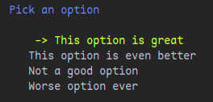
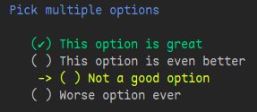

# Rainbow Picker

> *"Like pick, with colors!"*


Use this package as you would use pick:

```python
from rainbow_pick import rainbow_pick

options = [
    "This option is great",
    "This option is even better",
    "Not a good option",
    "Worse option ever",
]

title = "Pick an option"

rainbow_pick(options, title)

```

Will output something like this:



And: 

```python
from rainbow_pick import rainbow_pick

options = [
    "This option is great",
    "This option is even better",
    "Not a good option",
    "Worse option ever",
]

title = "Pick multiple options"

rainbow_pick(options, title, multiselect=True)
```
Will output this:



---

Install this library using ```pip```:

```pip install rainbow_pick@git+"https://github.com/GBiondo1310/rainbow_pick.git"```

or using ```uv```

```uv add https://github.com/GBiondo1310/rainbow_pick.git```